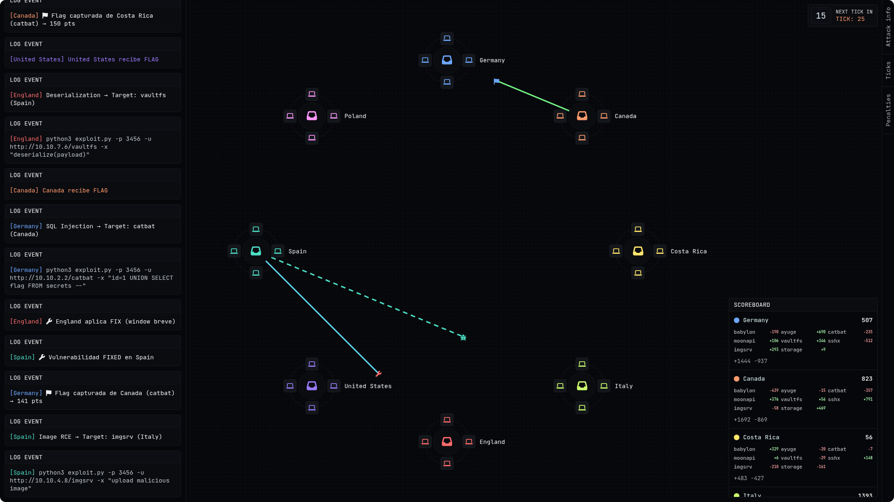

<div align="center">

### Attack & Defense Simulation
#### Web-based simulator for Attack and Defense CTF competitions | Real-time tick-based scoring | 8-team environment simulation | Educational tool for understanding A/D dynamics

[]()
[]()
[]()
[]()

</div>

---

### What is this repository for?

This repository contains a web-based simulation tool designed to demonstrate and educate on the mechanics of **Attack and Defense (A/D)** style CTF competitions. It provides a real-time, interactive environment where users can observe simulated attacks, defenses, and scoring dynamics in a controlled setting. Perfect for understanding tick-based scoring, service exploitation, flag capture, and team strategies without the need for a full infrastructure setup.

> [!IMPORTANT]
> **Educational Purpose**: This is a simulation tool for learning and demonstration. It does not perform real network attacks or interact with actual systems.

- **Real-time visualization** of attack vectors and packet flows between teams.
- **Tick-based scoring system** with 20-second intervals for score updates.
- **8-team simulation** with configurable services and vulnerabilities.
- **Interactive scoreboard** showing per-service point breakdowns.
- **Console logging** for detailed event tracking and analysis.

> [!TIP]
> **Getting Started**: Open `index.html` in a modern web browser to launch the simulation. No server required - it's pure client-side JavaScript.

### Repository Structure

```
ad_simulation/
├── assets/                           # Background and visual assets
├── index.html                        # Main HTML file for the simulation
├── main.css                          # Styling for the simulation interface
├── main.js                           # Core simulation logic and rendering
└── README.md                         # This file
```

> [!NOTE]
> **Navigation Tip**: The simulation is self-contained in a single HTML file with linked CSS and JS. Simply open `index.html` to run.

### Simulation Features

#### Real-time Attack Simulation
The simulator continuously generates random attacks between teams, visualizing exploit attempts as moving packets across the canvas. Each attack targets one of the predefined vulnerable services with realistic payload examples.

#### Services and Vulnerabilities
The simulation includes 8 different services, each representing common CTF vulnerability types:

- **babylon**: Path Traversal vulnerability
- **ayuge**: Buffer Overflow exploit
- **catbat**: SQL Injection attack
- **moonapi**: Authentication Bypass
- **vaultfs**: Deserialization vulnerability
- **sshx**: Race Condition exploit
- **imgsrv**: Image-based Remote Code Execution
- **store**: Insecure Direct Object Reference

> [!TIP]
> **Learning Path**: Each service includes example payloads that demonstrate real exploitation techniques used in A/D competitions.

#### Tick System and Scoring
- **20-second ticks**: Scores are calculated and applied every 20 seconds
- **Point range**: Successful flag captures award 80-200 points randomly
- **Defense mechanics**: Teams can apply temporary "fixes" that prevent exploitation
- **Per-service tracking**: Scoreboard shows points gained/lost per service

#### Visual Elements
- **Team nodes**: 8 teams positioned in a circle, each with unique colors
- **Packet animation**: Visual representation of attacks (outbound) and responses (inbound)
- **Canvas rendering**: Dynamic lines showing attack paths
- **Real-time updates**: All elements update continuously

---

### How to Use the Simulation

#### Quick Start
1. Clone or download this repository
2. Open `index.html` in any modern web browser (Chrome, Firefox, Safari, Edge)
3. The simulation starts automatically with random attacks every 1.2 seconds

#### Understanding the Interface



> [!WARNING]
> **Browser Compatibility**: Requires a modern browser with Canvas API support. No external dependencies needed.

##### Left Panel - Console
- Displays real-time log events for all simulation activities
- Shows attack attempts, successful exploits, defense actions, and tick summaries
- Color-coded by team for easy identification

##### Right Panel - Scoreboard
- **Total Score**: Cumulative points for each team
- **Service Breakdown**: Points gained (+) or lost (-) per service
- **Team Colors**: Visual dots matching the canvas team nodes

##### Top-Right - Tick Display
- **Countdown**: Seconds remaining until next score update
- **Tick Number**: Current simulation tick (increments every 20 seconds)
- **Clickable**: Click to force immediate tick update

##### Canvas - Main Visualization
- **Team Nodes**: Circular arrangement of 8 teams with member icons
- **Attack Lines**: Dashed lines for outbound attacks, solid for responses
- **Packets**: Animated icons representing exploits (bug), flags (flag), or fixes (wrench)

##### Side Panel - Controls
- **Attack Info**: Placeholder for future attack information display
- **Ticks**: Placeholder for tick management
- **Penalties**: Placeholder for penalty system

> [!TIP]
> **Pro Tip**: Watch the console logs to understand the sequence of events - attacks, defenses, and scoring updates.

#### Simulation Mechanics

##### Attack Flow
1. Random attacker selects random victim (never self)
2. Random service is targeted with appropriate payload
3. Packet travels from attacker to victim (visualized)
4. Defense check: 28% base failure rate + active fix windows
5. Success: Points awarded (80-200), logged in console
6. Response packet returns with flag or fix indication

##### Defense System
- Teams randomly enter "fix windows" lasting 2.5-8.5 seconds
- During fix window, all incoming attacks are blocked
- Visual indicator: Wrench icon on return packets

##### Scoring Logic
- Points applied at tick boundaries (every 20 seconds)
- Attacker gains points, victim loses equivalent amount
- Temporary ledger accumulates points until tick update
- Scoreboard updates with per-service breakdowns

---

### Technical Implementation

#### Technologies Used
- **HTML5 Canvas**: For dynamic rendering of team nodes and attack paths
- **CSS3**: Modern styling with CSS variables for theming
- **Vanilla JavaScript**: No frameworks - pure ES6+ for simulation logic
- **Font Awesome**: Icons for visual elements
- **Google Fonts**: JetBrains Mono for monospace typography

#### Key Components
- **Team Management**: 8-team configuration with positions, colors, and state
- **Attack Orchestration**: Timed intervals for periodic attacks and fixes
- **Rendering Loop**: 60fps animation using requestAnimationFrame
- **Event Logging**: Structured console output with team-specific styling
- **Score Calculation**: Real-time accumulation with tick-based application

#### Performance Considerations
- Optimized canvas clearing and redrawing
- Limited log history (400 entries) to prevent memory issues
- Efficient DOM manipulation for scoreboard updates
- Responsive design adapting to window resize

---

### Educational Value

#### Learning Objectives
- Understand the fast-paced nature of A/D competitions
- Learn about tick-based scoring systems
- Observe attack-defense cycles in real-time
- Study service-specific vulnerability patterns
- Analyze team performance through scoreboard metrics

#### Use Cases
- **CTF Preparation**: Visualize A/D mechanics before competing
- **Teaching Tool**: Demonstrate concepts to students or newcomers
- **Strategy Analysis**: Study different team positioning and attack patterns
- **Development Testing**: Test scoring algorithms and UI components

> [!TIP]
> **Integration**: This simulation could be extended to integrate with real A/D platforms for hybrid training environments.

---

### Future Enhancements

The simulation provides a foundation for additional features:

- **Configurable Parameters**: Adjustable tick intervals, team counts, point ranges
- **Attack Info Panel**: Detailed payload information and service documentation
- **Penalty System**: Implement SLA violations and defensive penalties
- **Replay Functionality**: Save and replay simulation sessions
- **Multiplayer Mode**: WebSocket-based multi-client synchronization
- **Service Customization**: Add/remove services with custom vulnerabilities

---

### Contributing

Contributions to improve the simulation are welcome! Areas for enhancement include:

- **UI/UX Improvements**: Better visual design and user interactions
- **Additional Services**: More vulnerability types and realistic payloads
- **Performance Optimizations**: Smoother animations and better memory management
- **Educational Features**: Guided tutorials and scenario presets
- **Code Quality**: Better structure, documentation, and testing

Please feel free to submit issues, feature requests, or pull requests.

### License

This project is licensed under the BSD 3-Clause License - see the [LICENSE](LICENSE) file for details.

---

**_Made with ❤️ for the CTF community_**

_Built to demystify Attack & Defense competitions_
